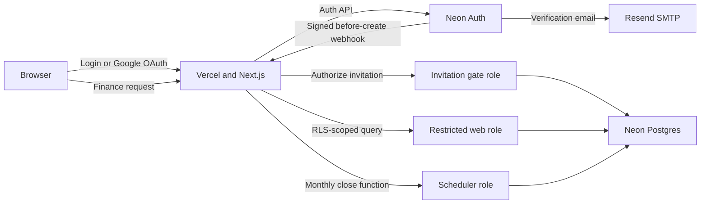

# Production Security Hardening Study Plan

This plan turns the recent security work into a learning project. The goal is
not to memorize the implementation. It is to understand the threats, explain
why each control exists, reproduce the important parts yourself, and recognize
where the current beta still accepts risk.

Plan for roughly **8 weeks at 5–7 hours per week**. Move more slowly if needed.
Do every exercise with synthetic users and data. Never practice destructive
operations or authorization attacks against the production database.

## How to study each topic

Use the same loop for every module:

1. **Read** the linked source material and relevant repository files.
2. **Draw** the request and trust boundaries without looking at the code.
3. **Explain** the control aloud in plain language.
4. **Break** a local or disposable-branch version deliberately.
5. **Repair** it without copying the existing implementation.
6. **Prove** the repair with a test, query, or HTTP response.
7. **Record** what you learned in a short dated note.

A topic is not complete until you can answer:

- What threat does this control address?
- What does it not protect against?
- What breaks if the control is removed?
- How can you verify it is active in production?
- What operational responsibility does it create?

## System mental model

Start by redrawing this flow from memory:



The central design rule is that successful authentication does not grant
unlimited database access. Every path receives only the minimum authority it
needs.

## Week 1: Threat modeling and financial-data classification

### Learn

- Authentication versus authorization.
- Confidentiality, integrity, and availability.
- Threat actors: another user, an attacker with a leaked credential, a browser
  extension, an operator, a compromised deployment, and an accidental mistake.
- Why balances, transaction history, merchant names, card expiry, and last four
  digits are sensitive even without a full card number or CVV.
- Why platform encryption at rest does not prevent authorization bugs.
- Why field-level encryption was intentionally deferred.
- The difference between PCI scope and general privacy/security obligations.

### Read in this repository

- [`docs/security/threat-model.md`](docs/security/threat-model.md)
- [`docs/adr/0001-server-side-confidentiality-boundary.md`](docs/adr/0001-server-side-confidentiality-boundary.md)
- [`docs/privacy/mexico-closed-beta.md`](docs/privacy/mexico-closed-beta.md)
- [`CONTEXT.md`](CONTEXT.md)

### External reading

- [OWASP Threat Modeling](https://owasp.org/www-community/Threat_Modeling)
- [OWASP Application Security Verification Standard](https://owasp.org/www-project-application-security-verification-standard/)
- [Current Mexican LFPDPPP text](https://www.diputados.gob.mx/LeyesBiblio/pdf/LFPDPPP.pdf)

### Exercises

1. Make a list of every sensitive field in `lib/finance/types.ts`. Give each one
   a confidentiality level and explain the impact of disclosure.
2. Draw trust boundaries for browser, Vercel, Neon Auth, Postgres, Resend, and
   the human operator.
3. Write three abuse cases:
   - User A tries to read User B's transaction.
   - An attacker steals the web database password.
   - A developer copies production data into a preview database.
4. Explain why encrypting `amount_cents` in the application would not stop an
   attacker who can make the application decrypt it.

### Checkpoint

You should be able to give a five-minute explanation of why the app uses
defense in depth instead of treating “the database is encrypted” as the whole
security strategy.

## Week 2: Sessions, verified identity, invitations, and OAuth

### Learn

- Password hashing versus password encryption.
- HTTP-only session cookies, cookie signing, expiry, and session revocation.
- OAuth authorization code flow at a conceptual level.
- Shared OAuth credentials versus application-owned credentials.
- Email verification as proof of channel ownership.
- Why authenticated but unverified sessions must also be rejected by backend
  actions.
- Account enumeration and generic authentication errors.
- Invite-only enrollment versus an unlisted signup page.

### Read in this repository

- [`lib/auth/server.ts`](lib/auth/server.ts)
- [`lib/auth/session.ts`](lib/auth/session.ts)
- [`app/api/auth/[...path]/route.ts`](app/api/auth/[...path]/route.ts)
- [`app/(auth)/sign-up/actions.ts`](<app/(auth)/sign-up/actions.ts>)
- [`components/auth/verify-email-form.tsx`](components/auth/verify-email-form.tsx)
- [`docs/adr/0002-retain-neon-managed-better-auth.md`](docs/adr/0002-retain-neon-managed-better-auth.md)
- The Google OAuth follow-up in [`TODO.md`](TODO.md)

### External reading

- [OAuth 2.0 overview](https://oauth.net/2/)
- [OWASP Authentication Cheat Sheet](https://cheatsheetseries.owasp.org/cheatsheets/Authentication_Cheat_Sheet.html)
- [OWASP Session Management Cheat Sheet](https://cheatsheetseries.owasp.org/cheatsheets/Session_Management_Cheat_Sheet.html)
- [Neon Auth production checklist](https://neon.com/docs/auth/production-checklist)
- [Neon Auth authentication flow](https://neon.com/docs/auth/authentication-flow)

### Exercises

1. Trace an email/password signup from the form to Neon Auth, the invitation
   webhook, the verification code, and the authenticated layout.
2. Find every call to `requireUserId()`. Explain why the shared guard checks
   `emailVerified` instead of relying only on the layout.
3. In a disposable branch, temporarily remove the verified-email check. Write a
   test or request that demonstrates the bypass, then restore it.
4. Compare Neon’s shared Google client with a custom Google client. Write down
   ownership, quota, branding, incident response, and rotation differences.
5. Explain why hiding the signup link does not make signup invitation-only.

### Checkpoint

Without looking at the code, explain the difference between:

- invited;
- authenticated;
- email verified; and
- authorized to access a specific Financial Record.

## Week 3: Signed webhooks, replay protection, and fail-closed behavior

### Learn

- Public-key signatures and the purpose of Ed25519.
- JWS protected headers, key IDs, JWKS, and key rotation.
- Why signatures cover the exact raw request bytes.
- Timestamp freshness and replay attacks.
- Idempotency keys and retry-safe processing.
- Fail-open versus fail-closed behavior.
- Request size limits and strict schema validation.

### Read in this repository

- [`lib/auth/neon-webhook.ts`](lib/auth/neon-webhook.ts)
- [`app/api/webhooks/neon-auth/route.ts`](app/api/webhooks/neon-auth/route.ts)
- [`lib/auth/neon-webhook.test.ts`](lib/auth/neon-webhook.test.ts)
- [`lib/auth/invitations.ts`](lib/auth/invitations.ts)
- [`db/migrations/023_beta_invitations.sql`](db/migrations/023_beta_invitations.sql)
- [`db/migrations/025_auth_invitation_precreate_identity.sql`](db/migrations/025_auth_invitation_precreate_identity.sql)

### External reading

- [RFC 7515: JSON Web Signature](https://www.rfc-editor.org/rfc/rfc7515)
- [Neon Auth webhooks](https://neon.com/docs/auth/guides/webhooks)

### Exercises

1. Reimplement the signature-verification test in a scratch file:
   - generate an Ed25519 key pair;
   - sign the documented payload;
   - verify it;
   - modify one byte and prove verification fails.
2. Explain the difference between the webhook event ID and a Neon user ID. Why
   did `user.before_create` require migration 025?
3. Send malformed webhook requests locally and verify that missing headers,
   stale timestamps, invalid signatures, and oversized bodies fail.
4. Send the same valid event twice and prove that it returns the same decision
   without consuming two invitations.
5. Explain why a database outage rejects new registrations instead of allowing
   them.

### Checkpoint

You should be able to explain why “the request came from Neon’s URL” is not
adequate webhook authentication.

## Week 4: PostgreSQL roles, RLS, and security-definer functions

### Learn

- PostgreSQL roles, login roles, group roles, membership, and inheritance.
- `BYPASSRLS`, table ownership, `ENABLE ROW LEVEL SECURITY`, and `FORCE ROW
LEVEL SECURITY`.
- `USING` versus `WITH CHECK` policies.
- Transaction-local configuration with `set_config(..., true)`.
- Connection-pool state leakage.
- `SECURITY DEFINER` risks and fixed `search_path`.
- Why the web, scheduler, migration, and invitation paths use different roles.

### Read in this repository

- [`lib/db/transaction.ts`](lib/db/transaction.ts)
- [`lib/db/runtime-role.ts`](lib/db/runtime-role.ts)
- [`db/migrations/001_init_finance.sql`](db/migrations/001_init_finance.sql)
- [`db/migrations/022_database_security.sql`](db/migrations/022_database_security.sql)
- [`db/migrations/024_scheduler_entrypoint.sql`](db/migrations/024_scheduler_entrypoint.sql)
- [`docs/adr/0003-rls-tenant-isolation.md`](docs/adr/0003-rls-tenant-isolation.md)
- [`docs/adr/0004-constrained-scheduled-monthly-close.md`](docs/adr/0004-constrained-scheduled-monthly-close.md)
- [`db/MIGRATIONS.md`](db/MIGRATIONS.md)

### External reading

- [PostgreSQL row security policies](https://www.postgresql.org/docs/current/ddl-rowsecurity.html)
- [PostgreSQL role membership](https://www.postgresql.org/docs/current/role-membership.html)
- [PostgreSQL `CREATE FUNCTION` security](https://www.postgresql.org/docs/current/sql-createfunction.html)
- [Neon row-level security guide](https://neon.com/docs/guides/row-level-security)

### Exercises

Use a disposable Neon branch:

1. Create two synthetic users and one transaction per user.
2. Connect as the restricted web role, set User A's transaction-local identity,
   and prove User B's row is invisible.
3. Try the same query without an identity and prove no user rows are returned.
4. Query `pg_roles` and explain every dangerous privilege rejected by
   `assertSafeRuntimeRole()`.
5. Prove the scheduler role cannot `SELECT` from `budgets` but can execute
   `app.close_monthly_budgets()`.
6. Prove the invitation role cannot read `beta_invitations` directly but can
   execute the invitation function.
7. Explain why PostgreSQL 18 role membership needed `WITH INHERIT TRUE, SET
FALSE`.

### Checkpoint

Given a new background job, design its database privileges without granting it
the web role or owner role.

## Week 5: Safe schema migrations and data integrity

### Learn

- Forward-only migrations and why applied files are immutable.
- Migration ledgers and checksums.
- Advisory locks preventing concurrent migration runners.
- One transaction per migration.
- Baselines for databases that predate a migration ledger.
- Composite foreign keys as tenant-integrity enforcement.
- Data migrations before adding `NOT NULL` or stricter constraints.

### Read in this repository

- [`scripts/db/migrate.ts`](scripts/db/migrate.ts)
- [`scripts/db/migrate.test.ts`](scripts/db/migrate.test.ts)
- [`db/MIGRATIONS.md`](db/MIGRATIONS.md)
- The category conversion in
  [`db/migrations/022_database_security.sql`](db/migrations/022_database_security.sql)

### Exercises

1. Explain how the runner reacts to:
   - two migration processes running simultaneously;
   - a changed applied file;
   - a missing applied file;
   - a partially migrated legacy database.
2. Create a harmless scratch migration, apply it to a disposable branch, and
   inspect its ledger row.
3. Change the applied file and observe the checksum failure. Revert the file;
   never “fix” the database checksum.
4. Explain why category ownership was migrated before `user_id` became
   non-nullable.
5. Draw the composite foreign key that prevents one user's recurring bill from
   referencing another user's category.

### Checkpoint

You should be able to plan a zero-data-loss constraint migration, including
backfill, validation, constraint creation, and rollback/recovery strategy.

## Week 6: Data minimization and server-side query design

### Learn

- Why data a browser does not need should never be sent to it.
- Server Components versus Client Components.
- Database-side filtering, sorting, counting, and pagination.
- Parameterized SQL and SQL injection prevention.
- Escaping `LIKE` patterns.
- Allowlisting dynamic ordering rather than interpolating user input.
- Offset pagination versus cursor pagination.
- Indexes, query plans, and bounded payloads.
- Debouncing search that triggers server navigation.

### Read in this repository

- [`lib/finance/queries.ts`](lib/finance/queries.ts)
- [`lib/finance/transaction-page-query.ts`](lib/finance/transaction-page-query.ts)
- [`app/(app)/transactions/page.tsx`](<app/(app)/transactions/page.tsx>)
- [`components/transactions/transactions-content.tsx`](components/transactions/transactions-content.tsx)
- [`components/transactions/search-input.tsx`](components/transactions/search-input.tsx)
- [`app/(app)/page.tsx`](<app/(app)/page.tsx>)

### Exercises

1. Compare the old “load all transactions into `FinanceProvider`” design with
   the current bounded shell and page-scoped transaction query.
2. For every transaction filter, identify the SQL clause and parameter value.
3. Attempt to pass a malicious sort value and explain why it cannot become SQL.
4. Use `EXPLAIN (ANALYZE, BUFFERS)` with synthetic data to inspect the default
   transaction ordering query.
5. Measure the serialized size of 10, 100, 1,000, and 10,000 synthetic
   transactions.
6. Explain the remaining tradeoff: the shell still carries operational data
   needed by cross-page finance calculations.

### Checkpoint

Design a page-scoped query for another module without exposing complete
historical data or breaking mutation refresh behavior.

## Week 7: Privacy lifecycle, deletion, and observability

### Learn

- Data access/export as a product capability, not an administrator query.
- Explicit export schemas and size limits.
- `Cache-Control: no-store` and attachment headers.
- Account deletion across two systems that cannot share a transaction.
- Idempotent retries and partial-failure messaging.
- Active data versus backup retention.
- ARCO rights at a conceptual level.
- Logging metadata without logging financial values, tokens, passwords, or raw
  database errors.
- Incident detection, containment, recovery, and communication.

### Read in this repository

- [`lib/privacy/data-export.ts`](lib/privacy/data-export.ts)
- [`lib/privacy/server.ts`](lib/privacy/server.ts)
- [`lib/privacy/account-deletion.ts`](lib/privacy/account-deletion.ts)
- [`app/api/account/export/route.ts`](app/api/account/export/route.ts)
- [`components/settings/account-data-settings.tsx`](components/settings/account-data-settings.tsx)
- [`app/(legal)/privacidad/page.tsx`](<app/(legal)/privacidad/page.tsx>)
- [`lib/observability/server-logger.ts`](lib/observability/server-logger.ts)
- [`docs/security/incident-response.md`](docs/security/incident-response.md)

### Exercises

1. List every table included in an export and justify each inclusion.
2. Verify that an unauthenticated export fails before any database query.
3. Explain the 10 MiB beta limit and design an asynchronous export for a larger
   dataset.
4. Walk through deletion failure after finance rows are removed but before Neon
   Auth deletes the identity. Explain why retrying is safe.
5. Create a sample security log event that is useful but contains no email,
   transaction data, token, or database URL.
6. Run a tabletop incident: a production database credential is accidentally
   posted in a public issue. Write the first ten actions in order.

### Checkpoint

Explain the difference between deletion from active tables, session revocation,
and expiry from provider backups.

## Week 8: Browser defenses, secrets, CI, deployment, and recovery

### Learn

- Content Security Policy and why `'unsafe-inline'` is still a limitation.
- HSTS, frame protection, MIME sniffing, referrer policy, and permissions
  policy.
- CSRF and trusted origins.
- Rate limiting as defense in depth.
- Secret storage, rotation, and environment scoping.
- Dependency vulnerabilities and transitive overrides.
- CI gates: formatting, type checking, linting, tests, builds, secret scanning,
  and audits.
- Production versus preview environments.
- Point-in-time recovery, snapshots, restore drills, and recovery objectives.

### Read in this repository

- [`next.user-config.mjs`](next.user-config.mjs)
- [`proxy.ts`](proxy.ts)
- [`.github/workflows/ci.yml`](.github/workflows/ci.yml)
- [`.github/dependabot.yml`](.github/dependabot.yml)
- [`package.json`](package.json)
- [`docs/operations/production-readiness.md`](docs/operations/production-readiness.md)
- [`docs/operations/vercel-firewall.md`](docs/operations/vercel-firewall.md)
- [`docs/adr/0005-closed-beta-recovery-exception.md`](docs/adr/0005-closed-beta-recovery-exception.md)

### External reading

- [OWASP Content Security Policy Cheat Sheet](https://cheatsheetseries.owasp.org/cheatsheets/Content_Security_Policy_Cheat_Sheet.html)
- [Vercel environment variables](https://vercel.com/docs/environment-variables)
- [Neon production checklist](https://neon.com/docs/get-started/production-checklist)
- [Neon backup strategies](https://neon.com/docs/manage/backups)
- [Resend SMTP documentation](https://resend.com/docs/send-with-smtp)

### Exercises

1. Use `curl -I` against production and explain every security header.
2. Remove one CSP source locally and observe which feature breaks.
3. Explain why production database variables are not assigned to preview
   deployments.
4. Run `bun audit`, pick one historical advisory from the lockfile work, and
   explain direct dependency, transitive dependency, exploitability, fix, and
   compatibility risk.
5. Read the CI workflow and explain the order of every gate.
6. Design a key-rotation procedure for:
   - database web role;
   - scheduler role;
   - Auth cookie secret;
   - cron secret;
   - Resend API key.
7. Explain the accepted free-plan recovery risk and define the event that must
   trigger a Neon plan upgrade.

### Checkpoint

You should be able to prepare a release checklist that distinguishes code
controls, provider configuration, manual verification, accepted risk, and
legal review.

## Capstone: rebuild the security boundary

Create a disposable branch from `main` and, without copying the current
implementation line by line:

1. Write a one-page threat model.
2. Build a two-user table protected by forced RLS.
3. Create a restricted login and prove cross-user isolation.
4. Build a signed, replay-resistant invitation webhook.
5. Add a page-scoped paginated query.
6. Add JSON export and retry-safe account deletion.
7. Add security headers and redacted logging.
8. Add tests for the expected attack paths.
9. Add CI checks and run a dependency audit.
10. Write a release decision containing:
    - controls verified;
    - controls not verified;
    - accepted risks;
    - rollback and recovery plan.

Present the result as if you were asking another engineer to approve the
release. They should be able to understand the design without trusting your
intentions or reading every line of code.

## Useful commands

```bash
# Repository quality gates
bun run format:check
bun run typecheck
bun run lint
bun run test
bun run build
bun run audit

# Inspect pending work
git status --short
git diff --check

# Manage beta invitations
bun run auth:invites list --status all

# Inspect response headers
curl -I https://personal-finance-app-nine-omega.vercel.app/login
```

Run database exercises only against a disposable Neon branch with synthetic
data. Keep owner credentials out of application and preview environments.

## Current accepted risks to revisit

These are learning opportunities, not hidden defects:

- The beta temporarily uses Neon’s shared Google OAuth credentials. Replace
  them with an application-owned OAuth client before widening enrollment.
- The free Neon plan provides only a six-hour recovery history and no scheduled
  30-day snapshot policy. Upgrade before storing data that users cannot easily
  reconstruct.
- The privacy notice temporarily uses incomplete controller-address details.
  Replace them and obtain Mexican legal review.
- Neon Managed Better Auth is still beta and currently lacks MFA. Reassess at
  every expansion of the beta.
- The CSP permits inline scripts for the current Next.js integration. Study
  nonce-based CSP as a future hardening step.

## Final mastery questions

You have completed the plan when you can answer all of these without opening
the repository:

1. Why is a non-`BYPASSRLS` runtime role essential even when every query
   includes `WHERE user_id = $1`?
2. Why does the webhook verify raw bytes instead of parsed JSON?
3. Why is an event ID different from a user ID during `before_create`?
4. Why can an authenticated session still be unauthorized?
5. Why does the scheduler execute one function instead of receiving table
   access?
6. Why are migrations checksummed and locked?
7. Why is browser data minimization a security and performance control?
8. Why is account deletion retryable rather than atomic?
9. Why do encrypted disks not solve application authorization failures?
10. Which current beta risks are accepted, by whom, and what triggers their
    removal?
