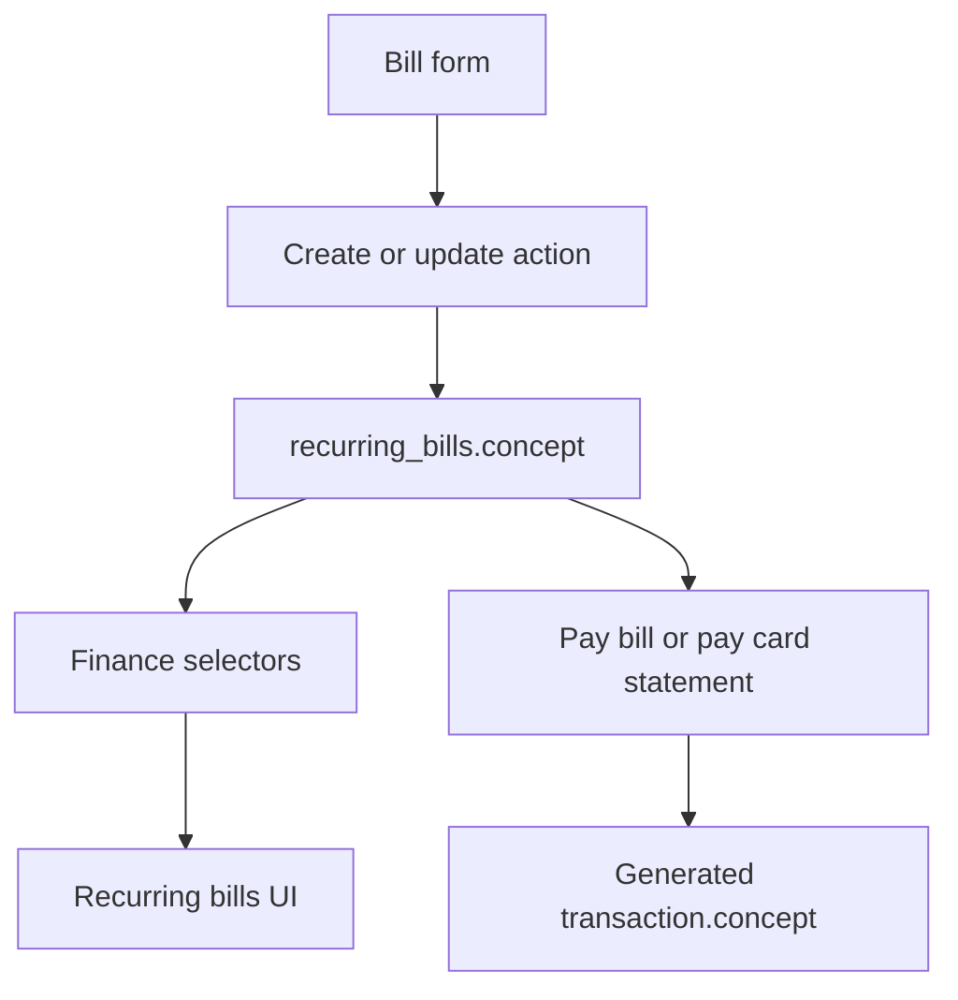

# Recurring Bill Concept - Design

**Date:** 2026-07-08
**Status:** Approved for implementation planning

## Summary

Add a required `concept` to each recurring bill so a bill can describe what the
payment is for, independently from the contact and category. This mirrors manual
transactions: the contact identifies who is involved, the category groups the
expense, and the concept names the specific purchase or obligation.

The change preserves the recurring bills module's existing rule that settled
history is immutable. Editing a bill concept changes only unsettled and future
occurrences. Already paid occurrences keep the transaction concept that was
written when they were paid, and skipped occurrences are left unchanged.

## Goals

- Persist a bill-level concept on `recurring_bills`.
- Require the concept in the create/edit bill form.
- Backfill existing bills from their linked contact display name.
- Use the bill concept for future transactions generated by bill payments and
  card statement payment materialization.
- Keep paid and skipped occurrence history frozen when the bill concept changes.

## Non-Goals

- Editing concepts on already generated transactions from the bill form.
- Adding a concept column to `recurring_bill_payments`.
- Changing occurrence identity, due date locking, archive/delete behavior, or
  money movement rules.

## Schema

Add `recurring_bills.concept text NOT NULL`.

The migration backfills existing rows from the linked contact:

1. Add the nullable column.
2. Set `concept = counterparties.display_name` for each existing bill.
3. Fall back to `Recurring bill` only if a defensive migration path encounters
   an empty value.
4. Add a check constraint matching transaction concepts:
   `length(trim(concept)) > 0 AND length(concept) <= 80`.
5. Set the column `NOT NULL`.

This keeps current behavior for existing bills because generated transactions
already use contact names as their concepts today.

## Application Model

`RecurringBillRecord` gains `concept: string`, and `NewRecurringBillRecord`
inherits it. `RecurringBill` view models also expose `concept` so product UI can
render it without re-deriving it from contact or category.

Create and update server actions validate the field with the same rules used by
transactions: trim, non-empty, max 80 characters. The database remains the final
authority through the check constraint.

## UI

The recurring bill create/edit dialog adds a `Concept` text input near the top
of the form, after contact and before the amount/category group. The field uses
the existing `FormField` + `Input` pattern, has a visible label, and shows
inline validation errors through the standard form helpers.

The recurring bills table/list keeps the contact as the primary identity because
the module's existing design says a bill's identity comes from its contact. The
concept appears as secondary muted metadata under the contact/schedule line so
users can distinguish bills like:

- Contact: `Apple`
- Concept: `iCloud storage`
- Category: `Bills`

No new visual pattern is needed; this follows the existing table/list metadata
guidance in `DESIGN.md`.

## Data Flow

When a user creates or edits a bill, the form sends `concept` with the rest of
the bill definition. Selectors expose it in client state. When an unsettled
occurrence is later paid manually, or a card-assigned bill is materialized while
paying a card statement, the generated transaction uses `bill.concept`.

## History Behavior

The frozen-history rule is:

- Paid occurrences keep their existing transaction rows and transaction
  concepts.
- Skipped occurrences remain represented only by their existing payment row.
- Editing `recurring_bills.concept` affects only occurrences that have not yet
  been paid or skipped.
- Changing contact, category, amount, card assignment, or concept follows the
  same forward-looking behavior for unsettled occurrences.

This avoids rewriting past expense records and keeps statements, transactions,
and skipped history stable after settlement.

## Error Handling

Client validation catches empty and too-long concepts before submit. Server
validation returns the existing finance action result shape, so the dialog can
display field-level or form-level errors using the current inline status
message pattern. Database constraint failures fall through the existing
Postgres constraint handling path.

## Testing

Implementation should verify:

- Migration backfills existing bill concepts from contacts and enforces the
  non-empty/max-80 constraint.
- Creating a recurring bill requires and persists `concept`.
- Editing a recurring bill updates `concept` without changing settled payments
  or existing transactions.
- Selectors expose `bill.concept` for recurring bill rows.
- Manual bill payments create transactions with `bill.concept`.
- Card-assigned bill materialization during statement payment creates
  transactions with `bill.concept`.
